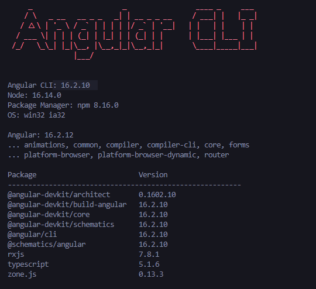
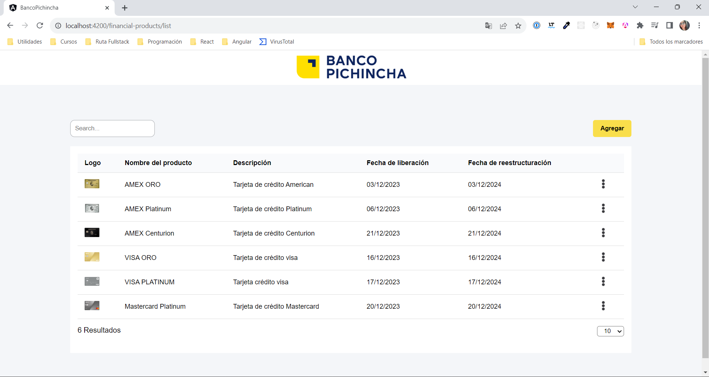
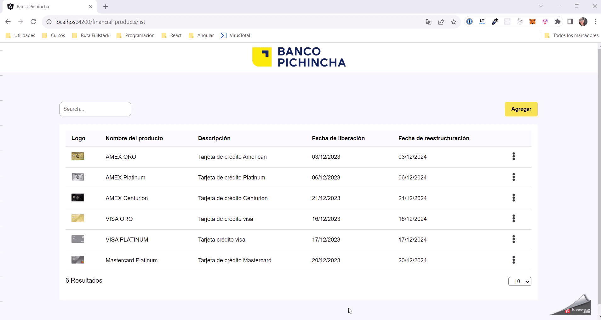
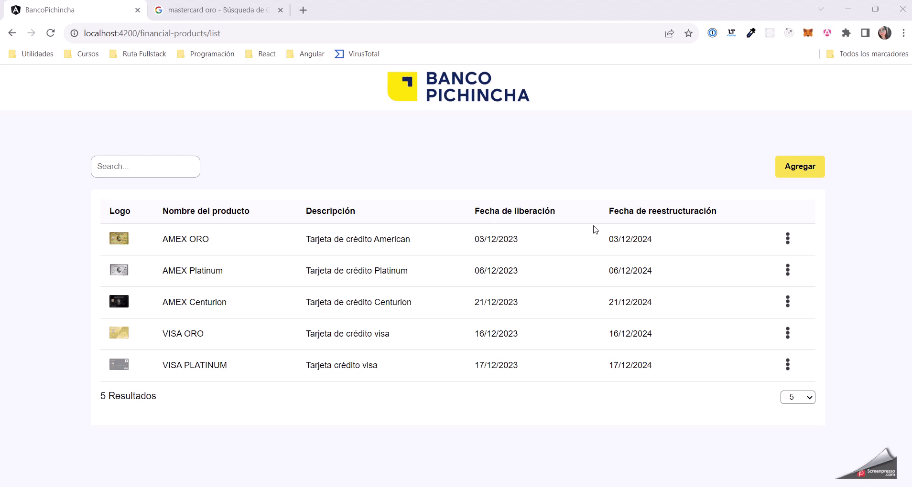
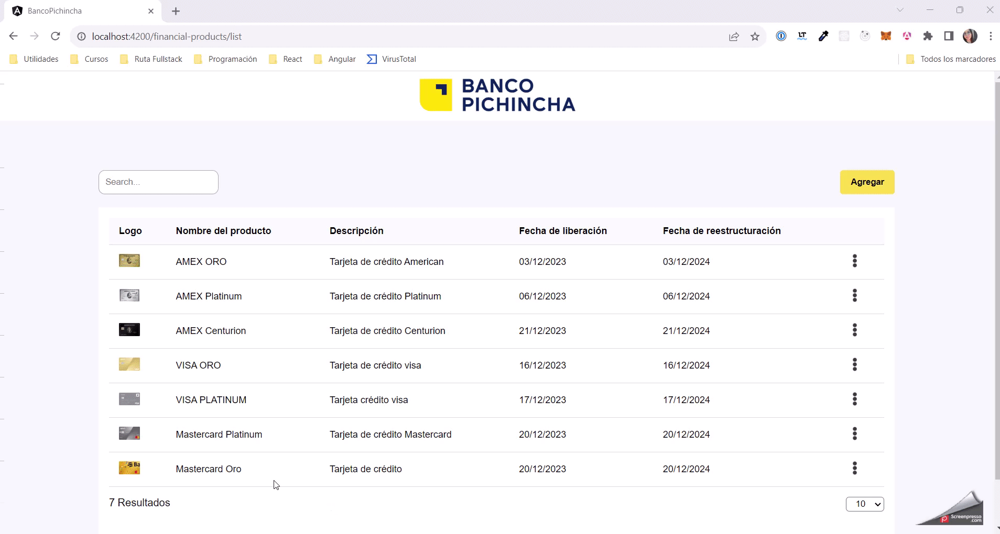
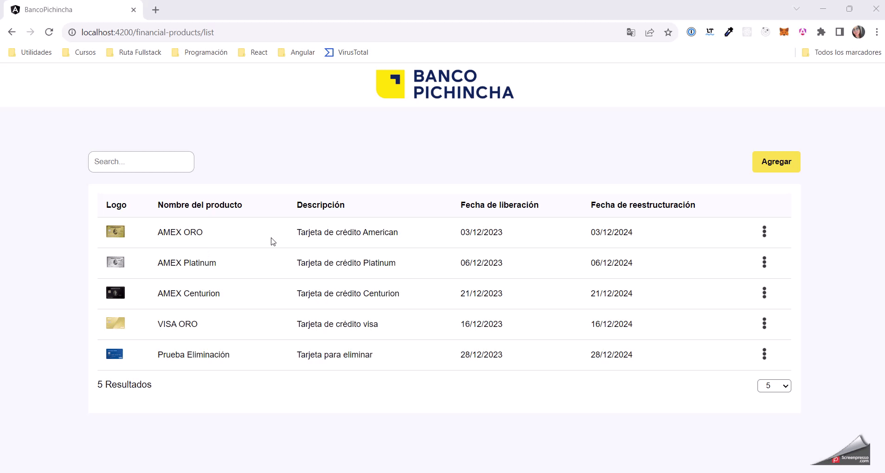
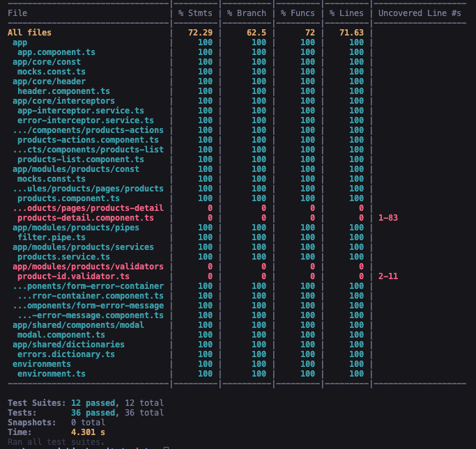

# Banco Pichincha - Prueba Alejandra Murillo

Este proyecto fue generado con la versión **16.2.10** de Angular y la versión **16.14.0** de node 

## Instalación

Descargar el código y ejecutar los siguientes comandos: 

    npm i
    ng serve -o

Navegar a la dirección http://localhost:4200/ para visualizar el proyecto.

## Funcionalidades

### F1. Listado de productos financieros

Pantalla desarrollada para visualizar el listado de productos financieros ofertados por el banco.

### F2. Búsqueda de productos financieros

Se implementa campo de filtro de búsqueda, a medida que se va escribiendo se va filtrando el listado, este aplica para todas las columnas

### F3. Cantidad de registros

Se implementa conteo de resultados en la parte inferior izquierda y select con las opciones 5, 10 y 20 para elegir el número de resultados a mostrar

### F4. Agregar producto

Se implementa funcionalidad de creación de producto, navegando al formulario de registro por medio del botón Agregar.

Se implementa la limpieza del formulario por medio del botón Reiniciar.

Se implementan las validaciones indicadas en el requerimiento (Requeridos, id unico, min y max caracteres, fecha minima, etc). 

### F5. Editar producto

Se permite la edición de un producto existente por medio de una opción en el dropdown de cada item del listado. 

### F6. Eliminar producto

Se permite eliminar un producto mostrando previamente un modal de confirmación, si se selecciona la opción "Cancelar" se cierra el modal solamente, pero si se selecciona la opción "Confirmar" se elimina el producto

## Ejecutar Test Unitarios

Implementados por medio de Jest, para ejecutarlos correr el comando 

    ng test

Se cuenta con una cobertura del 71.63%

